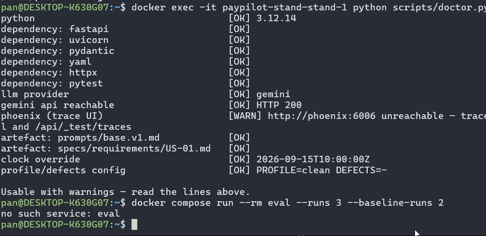

у тексті лекції:
```
    Baseline на clean: як читати дельту
        годинник ( POST/api/_test/clock ) і лише тоді ганяє кейси:
        `docker compose run --rm eval --runs 3 --baseline-runs 2`
        (clean двічі, lesson-02 тричі.)*
        * запустите в лабораторній
```

команда не виконується на момент її наведення у конспекті (сторінка 14), все для її виконання знаходится значно пізніше по тексту (сторінки 30-32)

> Піднятий стенд (make up), пройдений make doctor із зафіксованим часом (`CLOCK_OVERRIDE=2026-09-15T10:00:00Z` у `.env`), ключ у `.env`. Скрипт метрик `l02_eval.py` із кейсами `cases.json` — у репозиторії `paypilot-l02-eval`; як його запустити — нижче. Двадцять скарг — файл `complaints.md` у тому ж репозиторії. Результати аудиту промпту з L1. Доступ до `prompts/base.v1.md` і до `GET /api/_test/prompt` — зібраного промпту профілю з оверлеями.

1. виконання [docker compose run --rm eval --runs 3 --baseline-runs 2 --dry-run](notes/hw1-reference/runs/dry-run.md)
2. виконання [docker compose run --rm eval --runs 3 --baseline-runs 2](notes/hw1-reference/runs/full-run.md)
